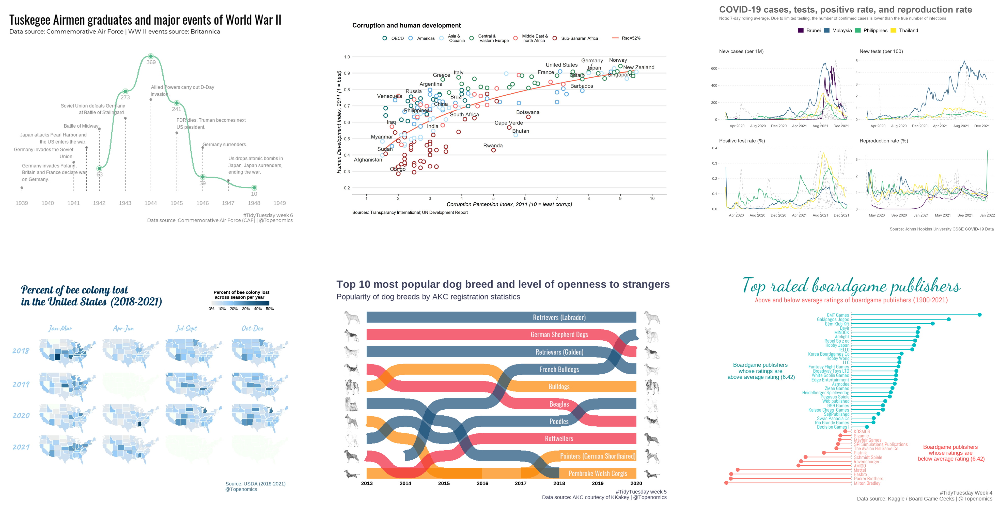

layout: true

```{r meta, echo=FALSE}
# setwd("./01_leverage-agecon-research-R")

# libraries
pacman::p_load(knitr, tidyverse, janitor, metathis)
xaringanExtra::use_share_again()
xaringanExtra::style_share_again(share_buttons = c("twitter", "facebook", "linkedin"))
meta() %>% 
  meta_name("github-repo" = "chris-allones/RTalks") %>% 
  meta_social(
    title = "Leveraging agri-econ research with R programming",
    description = "Demonstrating the power of R programming in leveraging ag-econ research.",
    url = "https://chris-allones.github.io/data-viz-ggplot2/index.html",
    image = "https://chris-allones.github.io/data-viz-ggplot2/images/preview.png",
    og_type = "website",
    og_author = "Christopher Llones",
    twitter_card_type = "summary_large_image",
    twitter_creator = "@Topenomics",
    twitter_site = "@Topenomics"
  )
```

```{r setup, echo=FALSE}
options(htmltools.dir.version = FALSE,
        knitr.table.format = "html")
knitr::opts_chunk$set(
  fig.width=9, fig.height=3.5, fig.retina=3,
  out.width = "100%",
  cache = FALSE,
  echo = TRUE,
  message = FALSE, 
  warning = FALSE,
  hiline = TRUE,
  comment = "",
  fig.retina = 3
)
```

```{r xaringan-themer, echo=FALSE, warning=FALSE}
library(xaringanthemer)
xaringanExtra::use_share_again()
xaringanExtra::style_share_again(share_buttons = c("twitter", "facebook", "linkedin"))
xaringanExtra::use_tile_view()
xaringanExtra::use_extra_styles(hover_code_line = TRUE,
                                mute_unhighlighted_code = FALSE)
xaringanExtra::use_animate_css()
xaringanExtra::use_animate_all("fade")
style_duo_accent(
  primary_color = "#073b4c",
  secondary_color = "#2a9d8f",
  inverse_background_color = "#073b4c",
  inverse_header_color = "#fff",
  
  # title_slide_background_color = "#073b4c",
  title_slide_background_image = "img/title_slide_background.jpg",
  title_slide_text_color = "#212529",
  text_font_size = "1.2rem"
)

```

---

## Outline

- Motivational example

- Brief history

- Who are the R useRs?

- Pros and Cons

- How to be a useR?

- Demo: production economics and efficiency analysis

---

## Motivational example

```{r echo=FALSE}
mpg_data <- mpg %>% 
  mutate(drive = case_when(drv == "f" ~ "front-wheel drive",
                           drv == "r" ~ "rear-wheel drive",
                           drv == "4" ~ "4-wheel drive"),
         transport = case_when(str_detect(trans, "auto") ~ "automatic trans.",
                               str_detect(trans, "manual") ~ "manual trans."))
```

.leftcol60[

**Data visualization**

```{r}
mpg_data
```
]
---

## Motivational example


.leftcol40[

**Data visualization**

```{r eval=FALSE, fig.height=4, fig.width=6, fig.align='center'}
ggplot(mpg_data, aes(x = displ, y = hwy))
```
]


.rightcol60[
```{r echo=FALSE, fig.height=4, fig.width=6, fig.align='center'}
ggplot(mpg_data, aes(x = displ, y = hwy))
```
]


---

## Motivational example

.leftcol40[

**Data visualization**

```{r eval=FALSE, fig.height=4, fig.width=6, fig.align='center'}
ggplot(mpg_data, aes(x = displ, y = hwy)) +
  geom_point() #<<
```
]

.rightcol60[
```{r echo=FALSE, fig.height=4, fig.width=6, fig.align='center'}
ggplot(mpg_data, aes(x = displ, y = hwy)) +
  geom_point()
```
]


---

## Motivational example


.leftcol40[

**Data visualization**

```{r eval=FALSE, fig.height=4, fig.width=6, fig.align='center'}
ggplot(mpg_data, aes(x = displ, y = hwy)) +
  geom_point(size = 3, alpha = 0.5) #<<
```
]

.rightcol60[
```{r echo=FALSE, fig.height=4, fig.width=6, fig.align='center'}
ggplot(mpg_data, aes(x = displ, y = hwy)) +
  geom_point(size = 3, alpha = 0.5)
```
]


---

## Motivational example


.leftcol40[

**Data visualization**

```{r eval=FALSE, fig.height=4, fig.width=6, fig.align='center'}
ggplot(mpg_data, aes(x = displ, y = hwy)) +
  geom_point(size = 3, alpha = 0.5) +
  geom_smooth(method = "lm") #<<
```
]

.rightcol60[
```{r echo=FALSE, fig.height=4, fig.width=6, fig.align='center'}
ggplot(mpg_data, aes(x = displ, y = hwy)) +
  geom_point(size = 3, alpha = 0.5) +
  geom_smooth(method = "lm")
```
]

---

## Motivational example


.leftcol40[

**Data visualization**

```{r eval=FALSE, fig.height=4, fig.width=6, fig.align='center'}
ggplot(mpg_data, aes(x = displ, y = hwy)) +
  geom_point(size = 3, alpha = 0.5) +
  geom_smooth(method = "lm") +
  facet_grid(transport ~ drive) #<<
```
]

.rightcol60[
```{r echo=FALSE, fig.height=4, fig.width=6, fig.align='center'}
ggplot(mpg_data, aes(x = displ, y = hwy)) +
  geom_point(size = 3, alpha = 0.5) +
  geom_smooth(method = "lm") +
  facet_grid(transport ~ drive)
  
```
]


---

## Motivational example


.leftcol40[

**Data visualization**

```{r eval=FALSE, fig.height=4, fig.width=6, fig.align='center'}
ggplot(mpg_data, aes(x = displ, y = hwy)) +
  geom_point(size = 3, alpha = 0.5) +
  geom_smooth(method = "lm") +
  facet_grid(transport ~ drive) +
  theme_bw() + #<<
  theme(plot.title = element_text(hjust = 0.5, face = "bold"), #<<
        strip.text = element_text(face = "bold")) + #<<
  labs(title = "Car fuel consumption", #<<
       x  = "Engine displacement (volume in litres)", #<<
       y = "Highway miles per gallon (mpg)") #<<
```
]

.rightcol60[
```{r echo=FALSE, fig.height=4, fig.width=6, fig.align='center'}
ggplot(mpg_data, aes(x = displ, y = hwy)) +
  geom_point(size = 3, alpha = 0.5) +
  geom_smooth(method = "lm") +
  facet_grid(transport ~ drive) +
  theme_bw() +
  theme(plot.title = element_text(hjust = 0.5, face = "bold"),
        strip.text = element_text(face = "bold")) +
  labs(title = "Car fuel consumption",
       x  = "Engine displacement (volume in litres)",
       y = "Highway miles per gallon (mpg)")
  
```
]

---

## Motivational example

**Some of my data viz work**

```{r echo=FALSE, out.width="85%", fig.align='center'}

```

---

## Brief history


